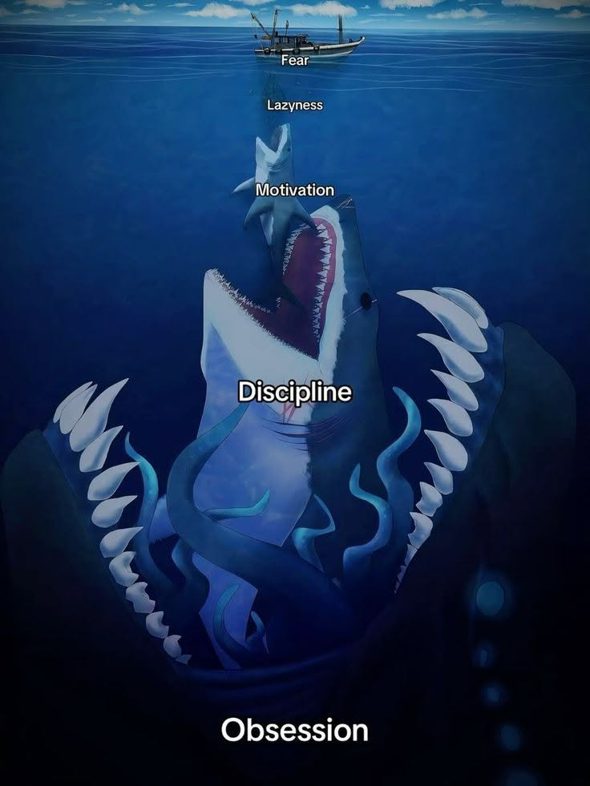

# 🚀 DAILY-TASK: The Engineering Forge
> *"Comfort < Motivation < Discipline < Obsession. Where High-Frequency Trading, Low-Latency Systems, and Agentic AI converge."*

  
  
  
  

---

## ⚡ About This Forge
This repository is the central nervous system of my daily engineering output. It captures my continuous evolution across **Low-Latency Architecture**, **Quantitative Finance**, and **AI Engineering**. As an MTech student at **IIT Bombay**, this mono-repo serves as my sandbox, practice ground, and project portfolio.

---

## 🗂️ Intent-Based Architecture
The repository is strictly organized by intent to separate production-grade builds from sandbox experiments:

### 🏗️ Projects (`/projects`)
*Production-ready implementations and complex systems.*
- **`article_tracker/`**: Full-stack application with end-to-end pipeline integration.
- **`agentic-ai/`**: Cutting-edge implementations of RAG, LangChain, and autonomous AI agents.
- **`mlops/`**: Production ML pipeline architecture, model versioning, and deployment tracking.

### 🏋️ Core Practice (`/practice`)
*Sharpening the sword: algorithms, execution speed, and problem-solving.*
- **`cp/`**: Competitive programming (Codeforces, advanced data structures).
- **`oa/`**: Online assessment solutions and algorithmic drills.

### 📖 The Sandbox (`/sandbox`)
*R&D, tutorials, and language mastery.*
- **Languages**: Deep-dives into `C++`, `Java`, `Lua`, and `Python`.
- **R&D**: Following advanced courses, YouTube architectures, and documentation notes.

### 🎓 Academia (`/college`)
*IIT Bombay Coursework.*
- **7th Semester**: Advanced algorithms, systems architecture assignments, and academic research.

### 🛠️ Shared (`/shared`)
*Infrastructure and Tooling.*
- Helper scripts, shared utilities, and repository management tools.

---

## 🔭 Current Trajectory

1. **⚡ Low-Latency Systems & Core Engineering**
   - Architecting highly concurrent systems in **C/C++**.
   - Optimizing execution logic, CPU cache utilization, and memory management.

2. **📈 Quantitative Finance & HFT**
   - Researching mathematical strategies and order book dynamics.
   - Building execution frameworks for High-Frequency Trading.

3. **🧠 AI Engineering & R&D**
   - Bridging Deep Learning (PyTorch/LLMs) with pure statistical modeling.
   - Building scalable, agentic AI infrastructure (LangGraph/LangChain).

---

## 🛠️ Technology Arsenal

| Domain | Technologies |
| :--- | :--- |
| **Core & Systems** | `C++20`, `C`, `Python`, `NeoVim`, `Arch Linux` |
| **Data & AI** | `PyTorch`, `Pandas`, `NumPy`, `LangChain`, `MLflow` |
| **Infrastructure** | `AWS`, `Docker`, `FastAPI`, `GitHub Actions` |

---

## 🤝 Establish Connection
I'm always open to discussing system architecture, HFT strategies, and AI implementations.

  
  
  

 

  <i>"Building tomorrow's infrastructure, one optimized cycle at a time."</i>

